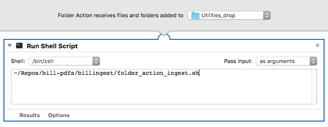

# Bill PDF Parser

Parse the PDF versions of utility bills for automated input to expenses spreadsheet.

## Simple Usage (billreader)
```bash
$ docker run --rm --mount type=bind,src=/path/to/inputs/,dst=/data billreader utilitybill.pdf

$ docker run --rm billreader -h
# displays help
```
where `utilitybill.pdf` exists in `/path/to/inputs` on Docker host

### The Full Picture
Each month, download the PDF bill from each vendor and drop in `$ONEDRIVE_PATH/Documents/Utilities_drop`.
(No matter from where you drop the file, it will sync to The Spine which executes the next step.)

There is an Automator Folder Action workflow on The Spine watching this folder (verify with 
<kbd>⌘</kbd>+<kbd>Space</kbd> "Folder Actions Setup") set up to run a shell script:
```bash
~/Documents/Python/bill-pdfs/billingest/folder_action_ingest.sh
```


That script executes a plain Python script which renames the file with three elements:
1. a basename, defaulting to "billdownload"
2. the modification date of the file (i.e. when it was downloaded from the provider)
3. the hash of the file contents

Finally, the script uploads the renamed files to cloud object storage (one of either AWS, GCP, IBM, 
or a local instance of MinIO) for further processing. The module `billreader`, in a container,
should act on these cloud files.

### Calling the `billreader` container
With the inclusion of the ingest step and cloud storage, the bill parsing itself can take place
on a Linux server with fewer issues, compared to The Spine which required a manual starting of the 
Docker engine each time.
```bash
# Set output file for docker logs
outpath=~/Documents/Utilities/docker.log
raw_cloud_bucket_path='FILL IN HERE'

docker run \
    --rm \
    --mount type=bind,src=$raw_cloud_bucket_path,dst=/data \
    billreader $1 >> $outpath 2>&1
```

## Development instructions
### Running with local python 
Recreate venv, and set environment variables
```bash
export PROJ_ROOT="$(pwd)"
```

### Rebuilding Docker image
```bash
$ docker build -t billreader .
```

### Starting a shell in the container
Since an entrypoint is defined, you must redefine it:
```bash
$ docker run --rm -it --entrypoint=/bin/bash billreader
```

## Resources
* [pdfminer.six](https://pdfminersix.readthedocs.io)
* [Yet Another Python Logging Setup](https://stackoverflow.com/questions/45287578/yet-another-python-logging-setup)
* [Simple logging demo](https://github.com/stevekm/logging-demo)
* [Practical Guide toUsing Setup.py](https://godatadriven.com/blog/a-practical-guide-to-using-setup-py/)
